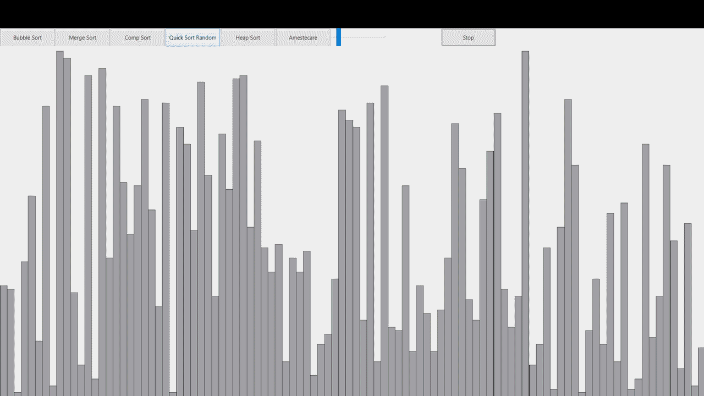

# Vizualizator de Sortari (C++ & Qt)

Programul ofera o interfata grafica interactiva pentru a vizualiza, in timp real, modul de functionare a diversilor algoritmi de sortare.

## Algoritmi implementati

- Sortarea prin interschimbare
- Bubble Sort
- Quick Sort cu pivot random
- Merge Sort
- Heap Sort

## Utilizarea Interfetei

La executarea programului, se va deschide fereastra principala care contine zona de desenare a elementelor si o bara de controale. 

- **Pornirea unei sortari:** Se face prin simplul click pe butonul algoritmului dorit.
- **Controlul vitezei:** Interfata contine un slider care controleaza viteza cu care se deruleaza algoritmul. Acesta modifica timpul cu care este oprit firul de executie pentru a permite urmarirea animatiei. Valoarea implicita este 5. Mutarea slider-ului spre stanga accelereaza animatia, in timp ce mutarea lui spre dreapta o incetineste.
- **Butonul Stop:** Intrerupe executia algoritmului curent. 
- **Butonul Amestecare:** Amesteca aleatoriu vectorul.

## Detalii Vizuale

Elementele isi schimba culoarea in functie de starea lor:
- **Gri:** Culoarea de baza.
- **Rosu:** Coloanele se coloreaza in rosu cand se face o interschimbare.
- **Verde:** La finalizare coloanele se vor colora intr-o unda verde de la stanga la dreapta.
